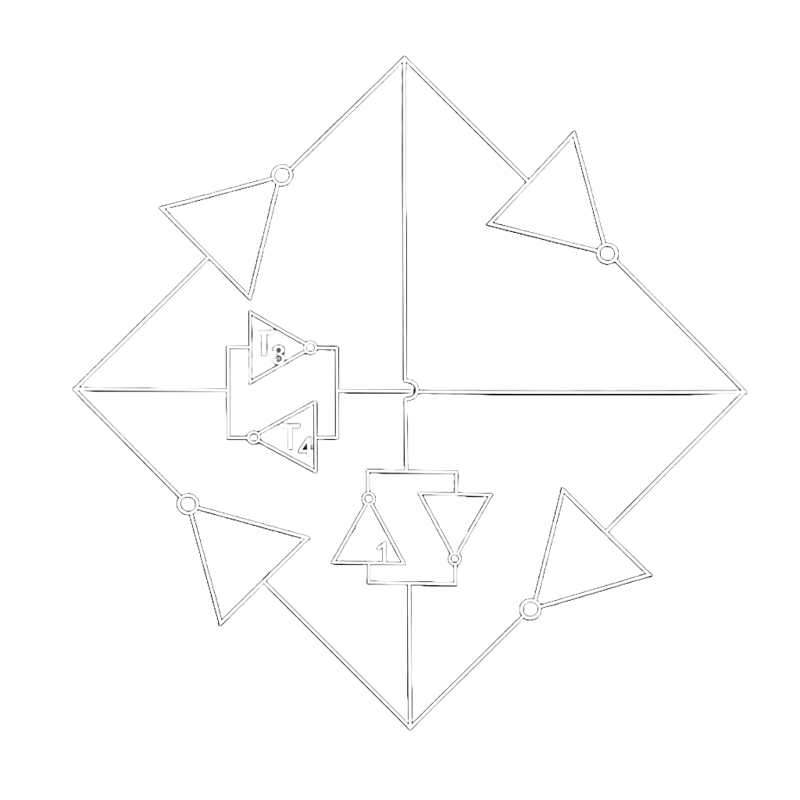

# Tetrahedral Oscillator for Tiny Tapeout

A compact SKY130 oscillator implemented as a semi-custom Tiny Tapeout analog layout using SKY130 standard cells, focused on the study of tetrahedral-style feedback, coupled CMOS inverter pairs, capacitive loading, and post-layout verification.

## Overview

This repository contains the design collateral for a compact tetrahedral oscillator targeting the Tiny Tapeout SKY130 analog/custom layout flow. The project explores a non-conventional oscillator topology based on coupled CMOS inverter pairs rather than a standard odd-stage ring oscillator, using a semi-custom implementation style based on SKY130 standard cells.

The implementation includes schematic-level design files, Magic layout collateral, exported GDS/LEF files, SPICE netlists, simulation testbenches, and workflow documentation. The intent is to keep the project reproducible and inspectable using open-source microelectronics tools.

## Academic Motivation

The design is motivated by the paper **“Analysis and Design of a Tetrahedral Oscillator”** by **Richelle L. Smith** and **Thomas H. Lee**. The oscillator concept is adapted here as an educational and experimental SKY130 layout exercise, with emphasis on physical implementation, parasitic-aware simulation, and observation of internal oscillator behavior.

  
   
  <em>Conceptual tetrahedral oscillator schematic adapted from the reference paper.</em>

The project was developed in the context of a final project for the Digital Electronics course at the Faculty of Engineering Mexicali, Universidad Autonoma de Baja California (UABC), within the Semiconductors and Microelectronics program.

This project is not intended to claim a direct reproduction of the published circuit. Instead, it uses the tetrahedral oscillator idea as a basis for studying coupled feedback, inverter-pair dynamics, and layout constraints in a small open-source integrated circuit design flow.

## Project Objectives

- Implement a compact tetrahedral-style oscillator using a semi-custom approach with SKY130 standard-cell based layout elements.
- Study oscillation behavior at the internal core nodes before output buffering.
- Provide buffered observation nodes for easier probing and integration.
- Export GDS and LEF collateral compatible with the Tiny Tapeout analog/custom layout flow.
- Maintain a reproducible repository structure for schematic, layout, simulation, and verification review.

## Project Summary

| Item | Value |
| --- | --- |
| Top module | `tt_um_tetrahedral_oscilator` |
| Process | SKY130 |
| Target | Tiny Tapeout analog/custom layout |
| Tile size | `1x2` |
| Design type | Analog oscillator |
| Implementation style | Semi-custom layout using SKY130 standard cells |
| Supply | 1.8 V core supply |
| Clock | `0 Hz` |
| Author | Juvenal Romero Pedraza |

## Design Concept

The oscillator core is based on multiple CMOS inverter stages arranged in a tetrahedral-style feedback structure. Instead of relying on a conventional ring oscillator topology, the design uses coupled inverter-pair feedback and distributed capacitive loading to encourage oscillation.

The internal core nodes are the most important signals for understanding the oscillator behavior. The buffered outputs are included to provide cleaner observation points, but they are not the source of the oscillation mechanism.

## Design Methodology

The project was developed through a custom-layout oriented workflow:

- Schematic capture and netlist generation for the oscillator core.
- Manual layout work in Magic using SKY130-compatible layout structures.
- Addition of capacitive loading at selected internal nodes.
- Buffering of selected oscillator nodes for output observation.
- Export of GDS and LEF collateral.
- Transient simulation using SPICE testbenches.
- Comparison between oscillator core behavior and buffered output behavior.

## Online Viewers

- [GDS layout viewer](https://romeruu-dev.github.io/ttsky-tetrahedral-oscillator/)
- [Xschem schematic viewer](https://xschem-viewer.com/?file=https://github.com/ROMERUU-dev/ttsky-tetrahedral-oscillator/blob/main/xschem/tt_um_tetrahedral_oscilator_xschem_lvs.sch)

## Verification Flow

The intended verification flow is:

- Review the schematic through the online Xschem viewer.
- Inspect the final physical design through the online GDS layout viewer.
- Run or review the transient SPICE testbenches in `tb/`.
- Review generated simulation outputs in `runs/results/`.
- Compare the internal oscillator core nodes against the buffered output nodes.

## Simulation Results

The oscillator was evaluated at two observation points: directly at the internal core nodes and after the output buffer chain. This distinction is important because the oscillator core is the primary circuit under study, while the buffered outputs are observation interfaces.

### Oscillator Core

The internal nodes `x9/Y`, `x4/A`, `x9/A`, and `x8/A` are used to study the behavior of the oscillator before the buffer stages. These nodes are the most relevant signals for understanding the coupled inverter-pair feedback network and its transient behavior.

### Buffered Outputs

The buffered outputs provide external observation points derived from the oscillator core. They are useful for probing and integration, but they should be interpreted as buffered representations of the core activity rather than independent oscillator sources.

## Layout Strategy

The oscillator core is implemented as a semi-custom physical layout using SKY130 standard-cell based structures placed manually in Magic. Because the circuit contains coupled feedback and multiple active devices around internal nodes, a semi-custom analog/mixed-signal layout approach is more appropriate than treating the block as a conventional RTL-to-GDS digital design.

The final layout collateral is kept in `gds/`, `lef/`, and `mag/`. The exported layout can be inspected with the online GDS viewer linked above.

## Supporting Tooling

This project also uses custom support software developed to improve the SKY130 analog workflow:

- [SkyFlow / sky130-flow-gui](https://github.com/ROMERUU-dev/sky130-flow-gui): local GUI workflow for organizing SKY130 projects, running simulations, managing generated results, and keeping layout and simulation work in one place.
- [PNG-2-Layout](https://github.com/ROMERUU-dev/PNG-2-Layout): utility for converting transparent PNG artwork into layout-friendly geometry that can be cleaned up and integrated into a physical design flow.

SkyFlow was used to support simulation and project organization while iterating on the oscillator. PNG-2-Layout is included as supporting tooling for image-to-layout experiments associated with the broader workflow.

## Repository Structure

- `src/project.v`: Tiny Tapeout wrapper module
- `gds/`: final or imported GDS files
- `lef/`: LEF abstracts
- `xschem/`: schematics
- `mag/`: Magic layout
- `spice/`: design netlists
- `tb/`: local SPICE testbenches
- `runs/`: SKY130 Flow GUI outputs and simulation results
- `docs/`: notes, generated documentation, and viewer links

## Current Status

The repository contains the current schematic, layout, exported GDS/LEF collateral, SPICE netlists, and simulation files needed to review the design. GitHub Actions are configured for Tiny Tapeout GDS and documentation checks, as shown by the workflow badges at the top of this README.

This README does not claim silicon measurement results, final manufactured behavior, or a measured oscillation frequency.

## Key Takeaways

- The project demonstrates a compact semi-custom oscillator based on tetrahedral-style coupled inverter feedback.
- Internal oscillator core nodes and buffered outputs are treated as separate verification points.
- The design is documented as a reproducible university microelectronics project using open-source SKY130 tooling.
- The physical implementation is better understood as analog/mixed-signal feedback layout rather than ordinary digital RTL.

## Author

Juvenal Romero Pedraza

## Acknowledgment

This project was developed as a final project for the Digital Electronics course at the Faculty of Engineering Mexicali, Universidad Autonoma de Baja California (UABC), in the Semiconductors and Microelectronics program. It was also developed in the context of open-source microelectronics experimentation using the SKY130 process and the Tiny Tapeout analog/custom layout flow. The oscillator concept is academically motivated by prior work on tetrahedral oscillator analysis and design.
